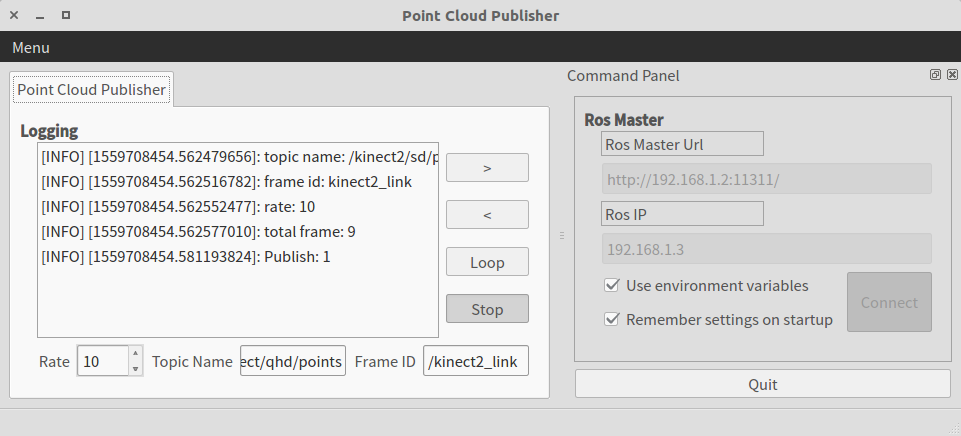

pointcloud_publisher_qt
==============================
****
|Author|Zhang Hongda|
|------|-----------------|
|E-mail|2210010444@qq.com|
|Institute|Harbin Institute of Technology|
****

### Description
A tf broadcaster with a graphical user interface.
### Installation
Step 1: clone the repository into your own workspace
```
cd ${PATH_TO YOUR_WORKSPACE_FOLDER}/src
git clone https://github.com/Zhang-Hongda/pointcloud_publisher_qt
```
Step 2: building
```
catkin_make
```
Step 3: activate the workspace
```
source ${PATH_TO YOUR_WORKSPACE_FOLDER}/devel/setup.bash
```
### Strat 
First, put your .pcd files in the [pcd](./pcd) floder. Then, run:
```
roscore
rosrun pointcloud_publisher_qt pointcloud_publisher_qt
```
### GUI
The interface should look like this:

### Usage
* The "__Ros Master__" panel
    * Users can specify the __url__ and __ip__ for connecting the ros master.
    * Check "__Use environment variables__" if you want to use the environmental configuration of your computer (recommended).
    * Check "__Remember settings on stratup__" to allows the system to load the current configuration during startup next time.
* The "__Point Cloud Publisher__" panel
    * Users can specify the publish __Rate__,  __Topic Name__ and __Frame ID__ for the point cloud messages.
    * Click on "__Publish__" button to publish point cloud messages.
    * Click on "__<__" button to publish former frame of point cloud.
    * Click on "__>__" button to publish next frame of point cloud.
    * Click on "__Loop__" button to publish frames in loop.

